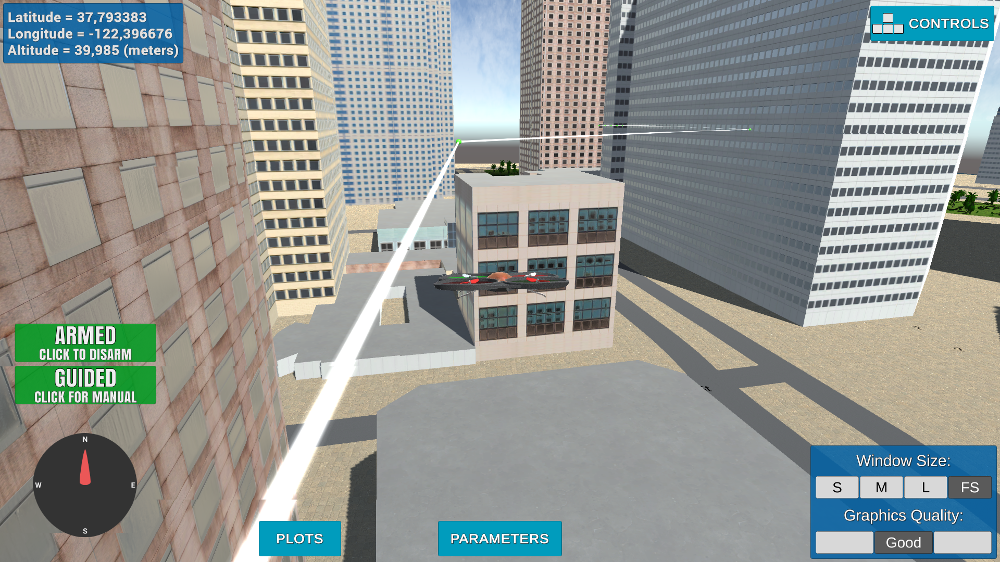

## Project: 3D Motion Planning

### Writeup / README

#### 1. Provide a Writeup / README that includes all the rubric points and how you addressed each one.  You can submit your writeup as markdown or pdf.  

You're reading it! Below I describe how I addressed each rubric point and where in my code each point is handled.

### Explain the Starter Code

#### 1. Explain the functionality of what's provided in `motion_planning.py` and `planning_utils.py`
Motion planning is basically modified and extended version of `backyard_flyer.py` project. The first noticeble differences are additional imports of `msgpack`, `planning_utils` and `frame_utils` from udacidrone. The last one will be necessary in order to allign local frame with the data imported from `colliders.csv`.

Next a slightly altered `States` class is created(it inherits from `Enum` class) with additional 7<sub>th</sub> `PLANNING` state . Furthermore the particular states are assigned using `auto()` method as numerical values of the states are not used, only their representations.

Subsequently instead of main `BackyardFlyer` class we have `MotionPlanning`, which basically is the core of the program. It consists of callback methods implementing event driven architecture of the project and methods implementing transitions and two new methods `send_waypoints` and `plan_path` which serve as waypoint generators and interface sending them into the simulator.

The `plan_path` method at its initial state sets travel altitude at 5 **[m]**. Next the goal point is set 10 **[m]** north and 10 **[m]** east giving total displacement of ~14 **[m]** NE :arrow_upper_right:. Initial motion is wobbly as the points aren't pruned and there is no diagonal action in `planning_utils`. Hence zig-zag path (**Fig.1**).


**Fig.1** Initial zig-zag path.

The `planning_utils` itself are helper functions that create bound of 2D grid and then populates it with obstacles turning it into 2.5D map.

Next `Action` class is defined determining possible actions. Initially those are four primary NEWS directions. They are represented as three member tuple.

After that we have a `valid_actions` function which checks for potential waypoints' collisions and if they are in bounds of the defined grid.

And eventually there is `a_star` function, which given the grid, heuristic, start and destination points, searches the grid for path and returns it. It uses Euclidean heuristic defined in `heuristic` function.

### Implementing Your Path Planning Algorithm

#### 1. Set your global home position

I have opened the colliders file with python `open` function. Next I took just the first line as a string data via `readline` method. Next I used `rstrip` and 'split' method to get rid of potential white spaces and to split the string line with `, ` delimiter, receiving two resulting strings. Subsequently those strings are again subdivided into list of strings, where the second element is the numerical value, which is then being casted into float value and assigned to `lat0` and `lon0`. Eventually I used `Drone` class' method to assign these value as global home position.

```
  origin = open('colliders.csv')
  line = origin.readline().rstrip().split(', ')
  origin.close()
  lat0 = float(line[0].split()[1])
  lon0 = float(line[1].split()[1])
  self.set_home_position(lon0, lat0, 0)
```


#### 2. Set your current local position

I have used `Drone` class' method `global_to_local` to calculate new local origin in relation to global home position, that was subsequently assigned to `local_origin` variable.

```
local_origin = global_to_local(self.global_position, self.global_home)
```

#### 3. Set grid start position from local position

Local position is derived based on offsets supplied by `create_grid` function. Because initial displacement of local origin relatively to global home is 0, initial position belief of location on grid would be (0,0), which is corner of the grid. Hence including offsets realigns the grid with global home as center. Then the values need to be casted as integers, as grid cells and their coordinates are discrete in nature.

```
grid, north_offset, east_offset = create_grid(data, TARGET_ALTITUDE, SAFETY_DISTANCE)
print("North offset = {0}, east offset = {1}".format(north_offset, east_offset))
grid_start = (int(local_origin[0] - north_offset), int(local_origin[1] - east_offset))
```

#### 4. Set grid goal position from geodetic coords

In general setting the goal position on the local grid is done by calculating displacement from home position with `global_to_local` method. Then the resulting point need to be corrected for offset and casted into integer values.

```
grid_goal = global_to_local((args.longitude, args.latitude,0),self.global_home)
grid_goal = (int(grid_goal[0]-north_offset),int(grid_goal[1]-east_offset))
```
The values themselves can be introduced via extended argument parser, when launching from the terminal. Default destination is at latitude = 37.794533 and longitude = -122.396266. Additionaly it is possible to introduce altitude value, for which configuration space will be calculated. By default I set it to 40 **[m]** as it isn't ridiculously high and enables the advantage of traversing 3D space.

```
parser = argparse.ArgumentParser()
parser.add_argument('--port', type=int, default=5760, help='Port number')
parser.add_argument('--host', type=str, default='127.0.0.1', help="host address, i.e. '127.0.0.1'")
parser.add_argument('--latitude', type=float, default=37.794533, help='Latitude value with 6 decimal figures')
parser.add_argument('--longitude', type=float, default=-122.396266, help='Longitude value with 6 decimal figures')
parser.add_argument('--altitude', type=int, default=40, help='Altitude integer value')
parser.add_argument('--safe_dist', type=int, default=10, help='Safety distance from obstacles integer value')
args = parser.parse_args()
```
Furthermore it is possible to introduce safety margin from the obstacles. By default I made it 10 **[m]**. Unfortunately I was not able to fully get rid of zig-zag waypoints, hence I increased the deadband for waypoint transition to 5 **[m]** so that drone is less vulnerable to those zig-zag ladder waypoints. And 10 **[m]** safety distance takes into consideration drone's inertia, so that it still can avoid crashing into buildings.

```
elif self.flight_state == States.WAYPOINT:
    if np.linalg.norm(self.target_position[0:2] - self.local_position[0:2]) < 5.0:
        if len(self.waypoints) > 0:
            self.waypoint_transition()
```

#### 5. Modify A\* to include diagonal motion (or replace A\* altogether)

As instructed I introduced additional 4 diagonal actions. I kept convention of windrose directions.

```
    NORTH = (-1, 0, 1)
    NE = (-1, 1, np.sqrt(2))
    EAST = (0, 1, 1)
    SE = (1, 1, np.sqrt(2))
    SOUTH = (1, 0, 1)
    SW = (1, -1, np.sqrt(2))
    WEST = (0, -1, 1)
    NW = (-1, -1, np.sqrt(2))
```

Thanks to that I have obtained action window that looks more less like table below:

|:arrow_upper_left: |:arrow_up: |:arrow_upper_right: |
|-------------------|-----------|--------------------|
|:arrow_left:| :four_leaf_clover:| :arrow_right:|
|:arrow_lower_left:| :arrow_down:| :arrow_lower_right:|

Then some actions are eliminated in modified `valid_actions` functions.

```
    if x - 1 < 0 or grid[x - 1, y] == 1:
        valid_actions.remove(Action.NORTH)
    if x - 1 < 0 or y + 1 > m or grid[x - 1, y + 1] == 1:
        valid_actions.remove(Action.NE)
    if y + 1 > m or grid[x, y + 1] == 1:
        valid_actions.remove(Action.EAST)
    if x + 1 > n or y + 1 > m or grid[x + 1, y - 1] == 1:
        valid_actions.remove(Action.SE)
    if x + 1 > n or grid[x + 1, y] == 1:
        valid_actions.remove(Action.SOUTH)
    if x + 1 > n or y - 1 < 0 or grid[x + 1, y - 1] == 1:
        valid_actions.remove(Action.SW)
    if y - 1 < 0 or grid[x, y - 1] == 1:
        valid_actions.remove(Action.WEST)
    if x - 1 < 0 or y - 1 < 0 or grid[x - 1, y - 1] == 1:
        valid_actions.remove(Action.NW)
```

#### 6. Cull waypoints

Because I used A\* algorithm on 2.5D grid instead of a graph, I decided to use integer collinearity check that Professor Nick Roy presented in collinearity lecture. First, in this implementation we are considering only 2D configuration space for one particular altitude. The waypoints are coplanar. The grid is discrete hence it is justified to use this method. Especially that integer collinearity method was about 3.5 times faster then the floating point one.

The method has been implemented as three functions in `planning_utils.py` library.

```
# Based on Professor Nick Roy's collinearity lecture
def point(p):
    return np.array([p[0], p[1], 1.])

def collinearity(p1, p2, p3):
    collinear = False
    det = p1[0]*(p2[1] - p3[1]) + p2[0]*(p3[1] - p1[1]) + p3[0]*(p1[1] - p2[1])
    if det == 0:
        collinear = True

    return collinear

def prune_path(path):
    pruned_path = [p for p in path]
    i = 0
    while i < len(pruned_path) - 2:
        p1 = point(pruned_path[i])
        p2 = point(pruned_path[i+1])
        p3 = point(pruned_path[i+2])
        if collinearity(p1, p2, p3):
            pruned_path.remove(pruned_path[i+1])
        else:
            i += 1
    return pruned_path
```

### Execute the flight
#### 1. Does it work?
It works, and my default goal point consistently shows advantage of traversing 3D space. Unfortunately the A\* algorithm works way slower than I initially expected. The further the goal point is from the home position, the longer it takes to return the path. But it consistently works from different locations. Unfortunately sometimes if the path exceedes a certain length, algorithm returns a path, prunes it, but simulator gets stuck on `takeoff_transition`. It happens randomly and I am not sure whether it is fault of my program, my hardware or the simulator. The path pruning works fairly well and final paths are relatively smooth (**Fig.2**).



### Double check that you've met specifications for each of the [rubric](https://review.udacity.com/#!/rubrics/1534/view) points.

# Extra Challenges: Real World Planning

The grid search is very inefficient. I'll definitely have to implement graph based method. But as I am late with submission already, I'll do it later. Thank You for Your attention.
